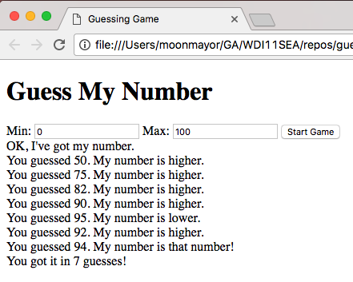

# Guessing Game
Use Angular to create a simple playable guessing game. The page should have
two inputs so the user can choose the minimum and maximum range of the numbers
to guess.

Include a "start game" button that starts the game playing. Only after the user
presses the start game button the computer should report, "OK, I've got my number"
and the game begins.

During the game the user is prompted with an input. They can enter their number
and press a "guess" button. After making a guess the computer will report back
"You guessed {{guess}}. My number is higher/lower."

If the user guesses the number correctly the computer should report, "You guessed
{{number}}. My number is that number!" Then, on another line, "You got it in {{num}}
guesses!"

# Implementation Details
Our solution attaches these variables to the `$scope`:

 -$scope.min = 0;
 -$scope.max = 100;
 -$scope.number = undefined;
 -$scope.newGuess = undefined;
 -$scope.previousGuesses = [];
 -$scope.isGameStarted = false;
 -$scope.isGameOver = false;

Our solution has these two functions:

- $scope.start
- $scope.makeGuess

## Licensing
All content is licensed under a CC­BY­NC­SA 4.0 license.
All software code is licensed under GNU GPLv3. For commercial use or alternative licensing, please contact legal@ga.co.

